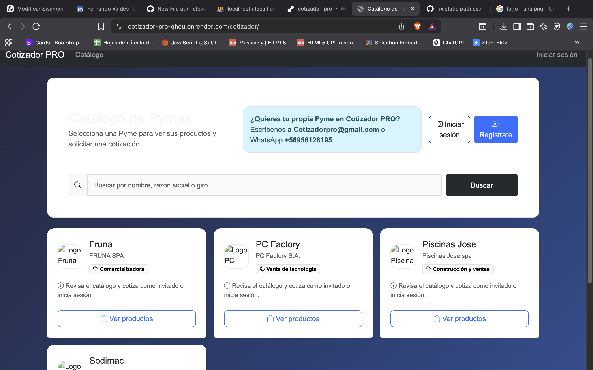
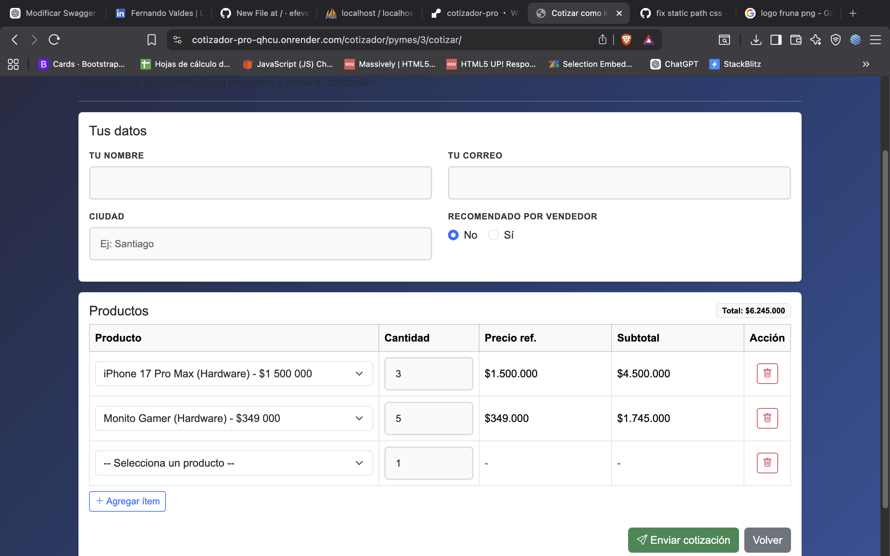
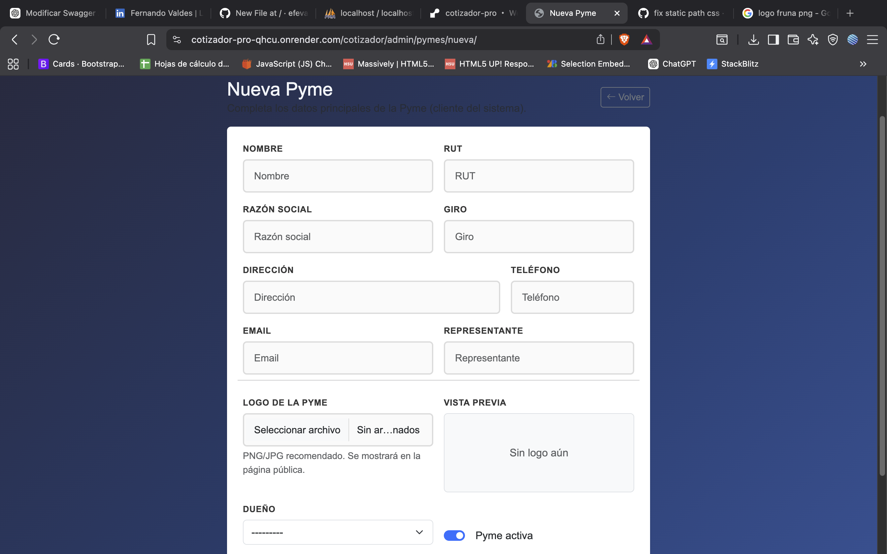
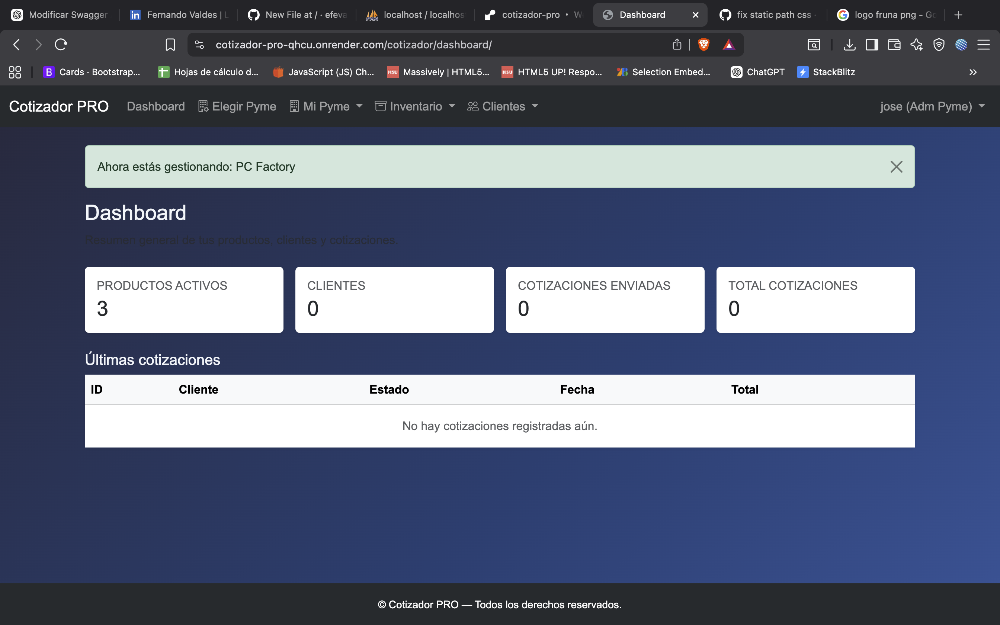

# 🧾 Cotizador PRO

Sistema web tipo SaaS para gestión de PYMES, catálogo público y generación de cotizaciones.

## 🚀 Funcionalidades
- Marketplace público de PYMES
- Sistema de roles (Admin, Pyme Owner, Seller, Invitado)
- Gestión de productos y clientes
- Creación y envío de cotizaciones
- Multi-empresa (multi-tenant)
- Panel de administración

## 🛠️ Tecnologías
- Python 3.11
- Django
- PostgreSQL
- Bootstrap 5
- Render (deploy)

## 🌐 Demo en producción
👉 https://TU-URL.onrender.com

## 🚀 Vista del sistema

## 👨‍💻 Autor
Fernando Valdés
